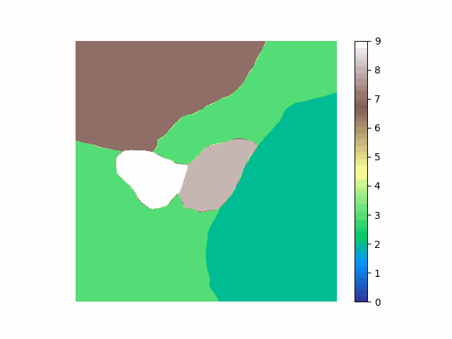

# Decision Cell Visualizations
This repository contains code to visualize the decision boundaries of a CIFAR-10 classifier.

## Decision Cells
Selects random 2d hyper-plane in the image space, centered around a test set image. Images that are similar, but slightly different from the original test images can then be sampled in a grid pattern around the test image. The decisions of a classifier are visualized using different colors. As time moves forward, the hyper-plane in rotated in the input space, allowing for different cross sections of the input space to be visualized.

<p align="center">
	
</p>

## Requirements
See `requirements.txt` for a list of required packages.

```bash
pip install -r requirements.txt
```

To generate gifs for visualization, [ImageMagick](https://imagemagick.org/index.php) must be installed.

## Running Code

To visualize the decision boundaries of a CIFAR-10 classifier, run the following command:

```bash
python vis_model.py --model_path <path_to_model> --save_path <path_to_save>
```

If you don't have a model handy, the code with train one for you. check ``fetch_args()`` in ``vis_model.py`` for more options related to visualization options.